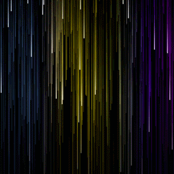

# Chroma Drencher
Animated background made with JavaScript and WebGL2.

*Watch color calmly drip down your desktop.*

## Features
- Unique dynamic rainbow rain effect
- Realtime parameter adjustment
- Wallpaper Engine integration
- RGB hardware control (iCue/Chroma)
- Optimized WebGL2 renderer using instanced rendering, transform feedback, and custom shaders

## Adjustable Parameters
- Droplet speed
- Droplet width
- Droplet height
- Droplet fall direction
- Droplet amount
- Gradient colors (up to 7)
- Gradient blend speed
- Single color mode
- Background tint
- Frame rate limit